# **_121 Fitness_**

121 Fitness is a small business set up to provide personalized fitness and nutrition plans. The site is targeted at people who are looking for this service. The site will be helpful for people to find out about what 121 Fitness does and how to sign up.

Welcome to the process through <a href="https://joeyo991.github.io/" target="_blank" rel="noopener">121 Fitness</a>

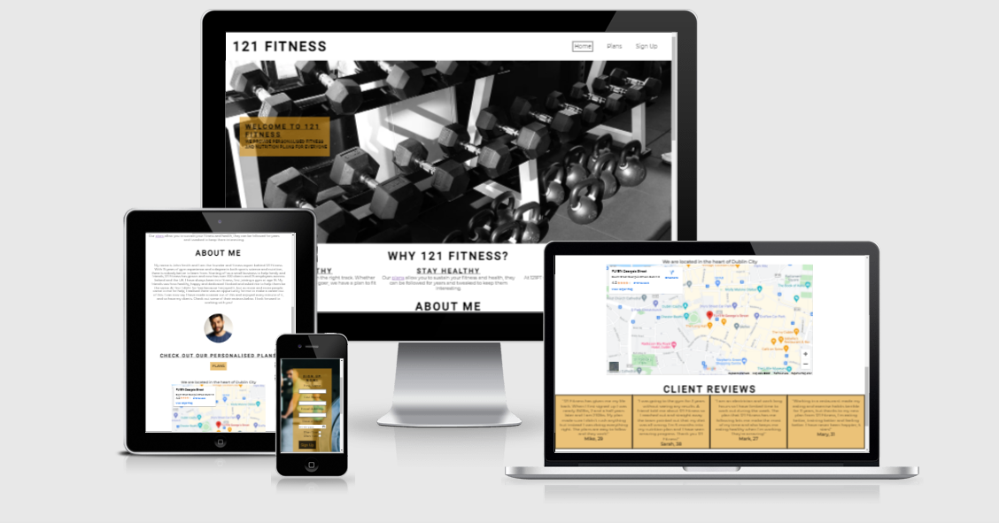

# Features

121 Fitness is set up to be welcoming and easy to use. It contains many features that the user would probably be familiar with, such as a navigation bar and a sign-up page. The site is inteded to be visually pleasing and invite the user to explore further.

## Existing Features  
  * ### Navigation Menu

    * Situated at the top of all the pages in the site, it is fully responsive and contains links to all the pages of the site to enable ease of navigation in one convenient location.
    * The logo is clickable with a link back to the home page for enhanced UX.
    * The page the user is currently on has a box around it in the navigation menu to easily remind them and for design purposes.

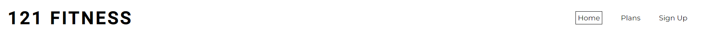

  * ### Reasons

    * Located on the home page directly below the welcoming section. It was intended that the welcoming section would lure the user in and make them scroll down to the reasons.
    * These are the reasons that the user would want to sign up to 121 Fitness.
    * An imbedded link to the plans page in the text will help the user navigate there quickly if they please.

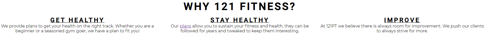

  * ### About Me
    
    * The About Me section lets the user know who the creator of 121 Fitness is.
    * This section lets the user know how 121 Fitness started and how its going.
    * The section also gives them a photo of 'John' to make it feel more personal.

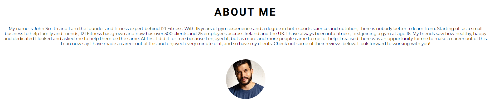

  * ### Map

    * The map is located below the About Me section.
    * It shows the user where the company is situated in Dublin City.

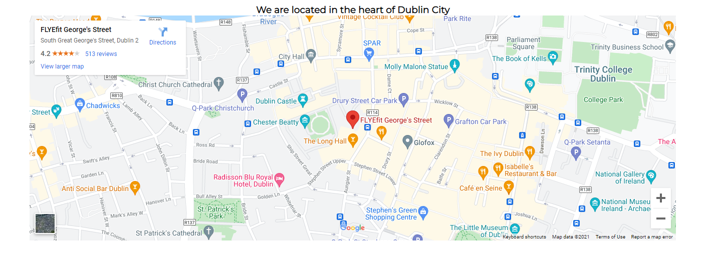

  * ### Reviews

    * The reviews section provides the user with some feedback from clients.
    * There are four reviews displayed giving a name, age and some text.
    * The reviews could be updated over time as more become available.

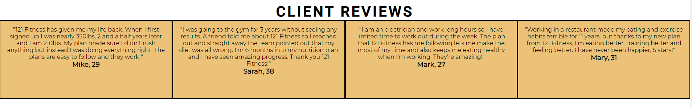

  * ### Footer

    * The footer invites the user to follow 121 Fitness on social media.
    * To enhance the UX the links open in a new tab.
    * The social media presence will help the user with their research into 121 Fitness and will also encourage them to connect.

  * ### Plans Page

    * The plans page gives the user information on the two plans available so far on 121 Fitness.
    * The price of each plan is also included for the user.
    * The image is meant to keep the user engaged on the page.
    * There is also a button which links to the sign up page if the user likes what they see.

  * ### Sign Up Page

    * The sign up page also has a image to keep the user engaged.
    * The sign up form is stylish and simple to use to enhance UX.
    * Each of the form input areas are required to ensure the user doesn't skip any of them by mistake.

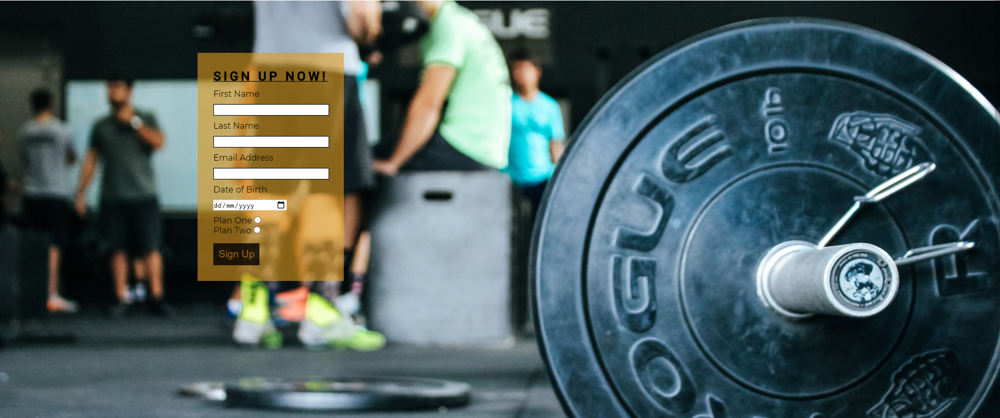 

  * ### Form Confirmation
    * This page confirms that the user has submitted the form.
    * For this project it validates the form only.
    * It provides a direct link back to the home page as well as the normal navigational links in the header.

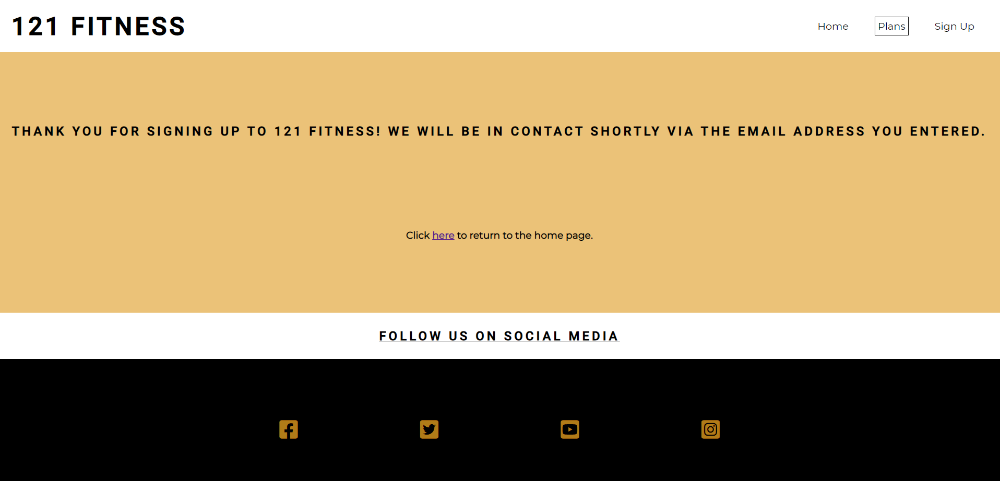

## Future Features

* My Account
  * Let the user check their progress and view their plan on the site.
* Gallery
  * The site could have a gallery of before and after pictures from clients.
* Payment
  * An incorporated e-commerce platform to allow users to purchase plans on the site.

# Technologies Used

* [HTML5](https://html.spec.whatwg.org/) - provides the content and structure for the website.
* [CSS](https://www.w3.org/Style/CSS/Overview.en.html) - provides the styling.
* [Gitpod](https://www.gitpod.io/#get-started) - used to deploy the website.
* [Github](https://github.com/) - used to host and edit the website.

# Testing

## Code Validation
The 121 Fitness site has been tested thoroughly. All the code has been run through the [W3C HTML Validator](https://validator.w3.org/) and the [W3C CSS Validator](https://jigsaw.w3.org/css-validator/). All errors seem to have been fixed or spotted before I ran my code through the validators.

The HTML code results are below:
* Home Page

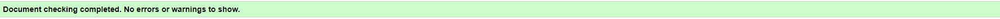

* Plans Page

* Sign Up Page

* Form Confirmation Page

The CSS results were as follows:

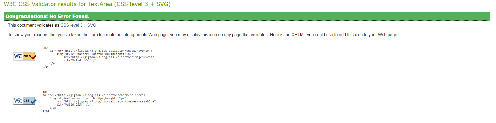

## Responsiveness Test
The responsivess design tests were carried out with [Google Chrome Dev Tools](https://developer.chrome.com/docs/devtools/) and a [Responsive Design Checker](http://ami.responsivedesign.is/#)

## Device Testing
121 Fitness was tested and works on the following devices:
* Moto G4
* Galaxy S5
* iPhone 5 / SE
* iPhone 6/7/8 (Plus)
* iPad / iPad Pro
* Displays < 1200px
* Displays > 1200px

## Browser Testing
121 Fitness was tested and works on the following browsers:
* Google Chrome
* Microsoft Edge
* Mozilla Firefox
* Safari

## Bugs
There were no bugs when validating my HTML and CSS. The only thing that is troubling me and is yet to be fixed is on the mobile screens. One of the headings is not centered and I have yet to figure it out. More testing will be done in the future to append this.

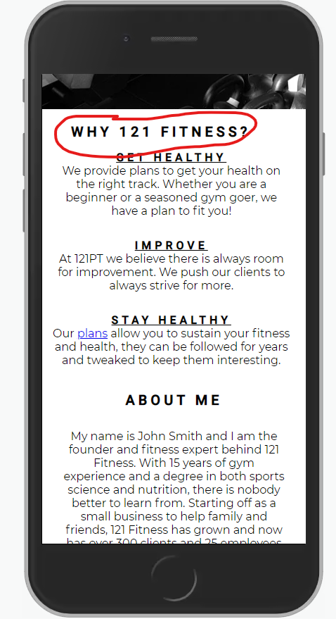

## Additional Testing

The site was also tested using [Google Lighthouse](https://developers.google.com/web/tools/lighthouse) in Chrome Developer Tools to test each of the pages for:

* Performance - How the page performs while loading.
* Accessibility - How accessible is the site.
* Best Practices - The site conforms to industry best practices.
* SEO - Search Engine Optimisation. Is the site optimised for search engine result rankings.

The results for 121 Fitness' Home Page are below:

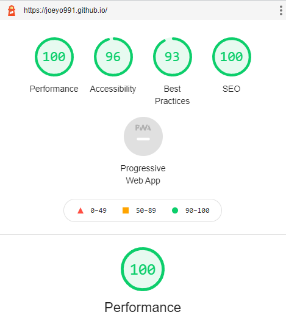

# Deployment

## To deploy the project

The site was deployed to GitHub Pages. The steps to deploy a site are as follows:

1. In the GitHub repository, navigate to the **Settings** tab.
2. In Settings, navigate to the **Pages** tab on the left side.
3. Under **Source**, select the branch to main / master, then click save.
4. Once the main branch has been selected, the page will automatically refresh and indicate that the deployment was successful.

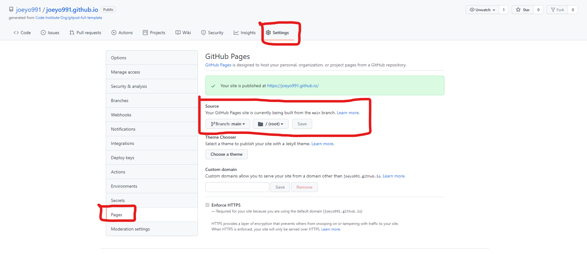

The live link to the GitHub repository is - https://github.com/joeyo991/joeyo991.github.io

# Credits

### Content
* The fonts came from [Google Fonts](https://fonts.google.com/).
* The icons came from [Font Awesome](https://fontawesome.com/).
* The map is embedded from [Google Maps](https://www.google.com/maps).
* Some of the code was inspired by the Love Running Project by the [Code Institute](https://codeinstitute.net/).
* The form validation page idea was from a [YouTube Tutorial](https://www.youtube.com/watch?v=fNcJuPIZ2WE).

### Media
* The images on this site were from [Pexels](https://www.pexels.com/) and [Pixabay](https://pixabay.com/).

# Acknowledgements
This site was completed as a Portfolio Project 1 for the Full Stack Software Developer (e-Commerce) Diploma at the [Code Institute](https://codeinstitute.net/). I would like to thank my mentor Precious Ijege, the Slack Community and everyone at the The Code Institute for their help and support. 121 Fitness is a fictional company inspired by my brother.

Joey O'Sullivan 2021.

